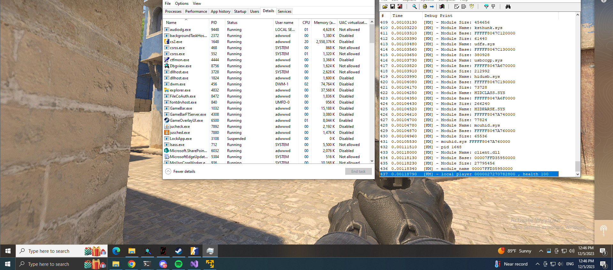
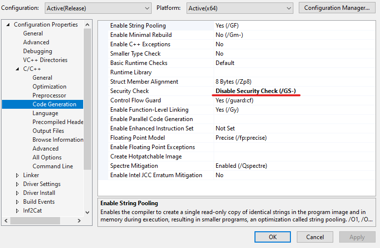

# Infestation

### Usermode

I've made simple usermode for testing, but i wont release, there are many sources available to copy and use.

### Kernelmode

<a target="_blank" href="https://streamable.com/g937bg">Watch the demo</a>

The driver can be used in any windows 10/11 versions.

**Available**
- [x] Kernel driver with extra addons
- [x] kernel **mouse_movement** 
- [x] Kernel **mouse_down** and **mouse_up** 
- [x] Read virtual memory (**mmcopy**)
- [x] Write virtual memory (**mmcopy/mdl**)
- [x] Kernel driver ready to be manually mapped **tested** (kdmapper/lenovo)

**Planning**
- [ ] TODO: Kernel Dispatch **Write Memory** 
- [ ] TODO: Protect usermode process
- [ ] TODO: Clear MmUnloadedDrivers
- [ ] TODO: Clear PiDDBCacheTable

## How to use ?

### 1.1 Manually mapping

- Clone the repository
- Open the solution in Visual Studio 2022 v143
- **DISABLE** `Security Check` if loading driver with driver mapper

- Build the project
- Copy the driver to the same folder as the executable
- Load the driver manually with services or driver mapper

### 1.2 Loading via service `SC`

- Clone the repository
- Open the solution in Visual Studio 2022 v143

- Build the project
- To load the driver **MUST HAVE**: driver certificate, using [DSE](https://github.com/hfiref0x/UPGDSED) or with [Windows Testmode](https://linuxhint.com/enable-disable-test-mode-windows-10-11/)

>create driver
sc create [service name] binPath= [path to your .sys file] type= kernel

>load driver
sc start [service name]

> stop driver
sc stop [service name]

> delete driver
sc delete [service name]

### Disclaimer ⚠

>I wont support or provide any binaries for this project, you are free to use it as you wish, this is a free project.

